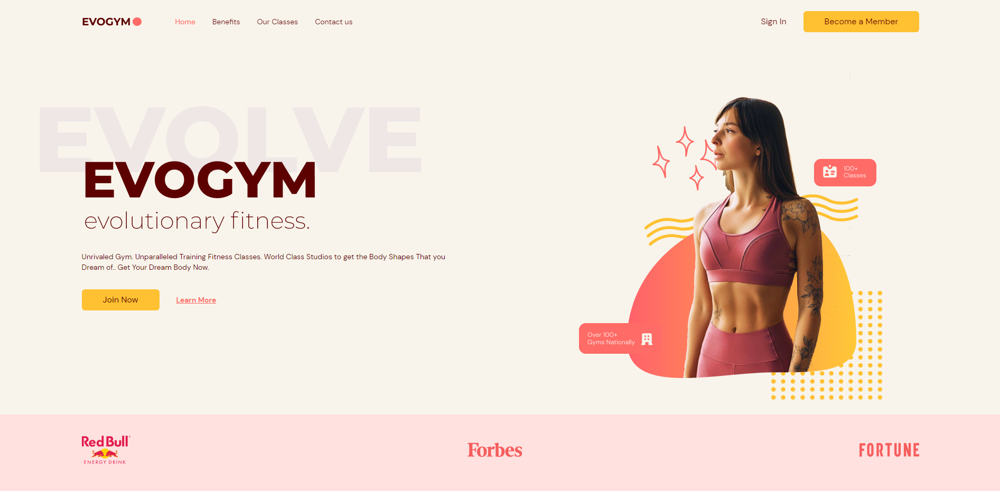
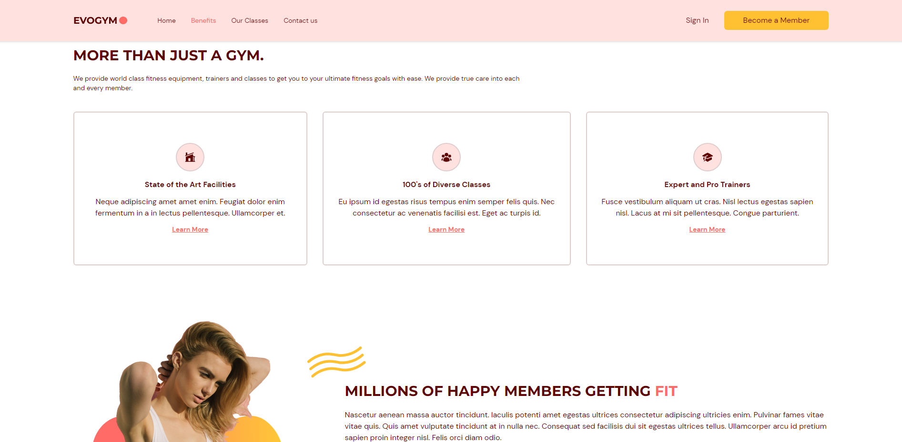
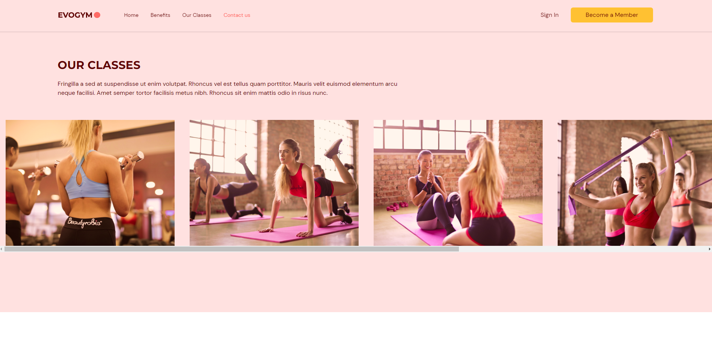
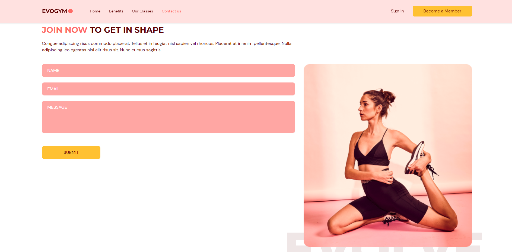
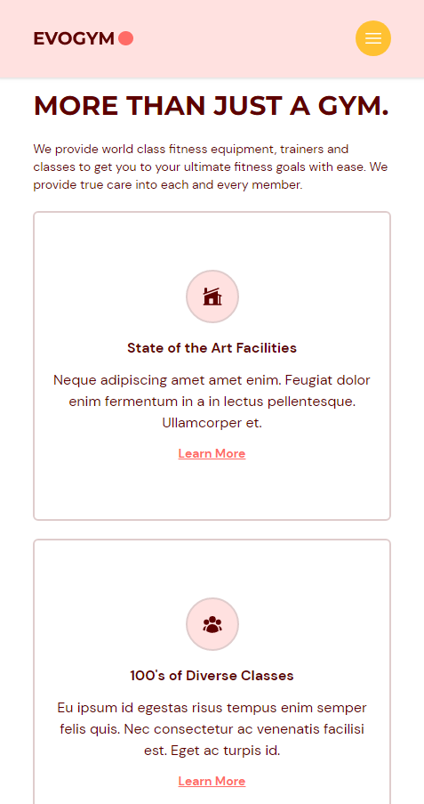
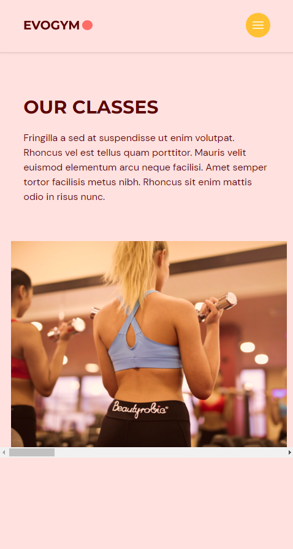
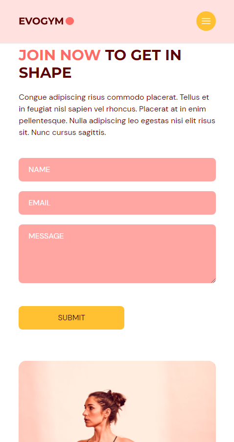

<h3 align="center">EvoGym</h3>

  <a href="https://1e69d6db.gym-app-5je.pages.dev/">Live Demo</a>

---

 Complete gym website (frontend focus)
      

## 📝 Table of Contents

- [About](#about)
- [Purpose](#purpose)
- [Built Using](#built_using)
- [Screenshots](#screenshots)
- [Credits](#credits)

## 🧐 About 

Complete gym application using React, Typescript, Vite, Tailwind, Hero Icons, Framer Motion, Form Submit, and React Anchor Link Smooth Scroll

## Purpose 

Improve TypeScript skills, gain more front end experience

## ⛏️ Built Using 

- [React](https://react.dev/) - Web framework
- [TypeScript](https://www.typescriptlang.org/) - Language
- [Vite](https://vitejs.dev/) - Tooling
- [Tailwind CSS](https://tailwindcss.com/) - Styling
- [Hero Icons](https://heroicons.com/) - Icons
- [Framer Motion](https://www.framer.com/motion/introduction/) - Animations
- [Form Submit](https://formsubmit.co/) - Form Submission
- [React Anchor Link Smooth Scroll](https://github.com/mauricevancooten/react-anchor-link-smooth-scroll) - Smooth Scrolling

## Screenshots 

DESKTOP

MOBILE

## ✍️ Credits 

- [EdRoh](https://github.com/ed-roh) - Tutorial
